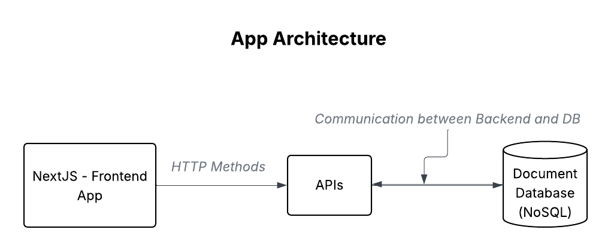

# Backend Note App

Educational project for learning backend development with FastAPI and Firestore. The main goal is to create a simple note-taking application with user authentication and CRUD operations for notes using Firestore as the database and consume the API with a React frontend.

## Architecture

The application follows this main architecture:

